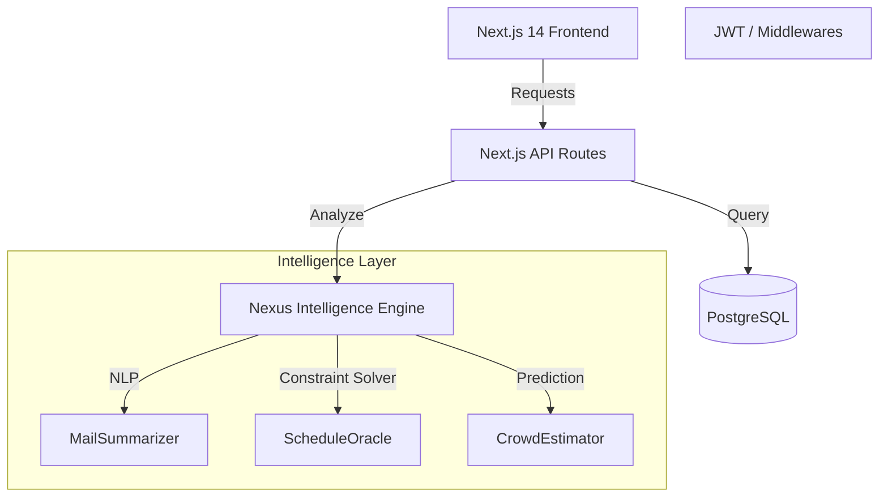

# AI-fusion-repos

# NEXUS: The Campus Super-App

> "The digital nervous system for campus life, intelligently connecting academics, daily routines, social coordination, and decision-making using AI."


## 🚀 Vision

NEXUS isn't just an app; it's an **intelligence layer**. It solves the problem of campus fragmentation by connecting isolated data points (timetables, emails, events) into a cohesive stream of actionable insights.

**Core Philosophy:**
- **Anticipate, don't just respond.** (e.g., "You have a 2-hour gap; the library is empty right now.")
- **Everything connected.** (e.g., A lost item post is automatically shown to people who had classes in that room.)
- **Premium Aesthetics.** A clean, "Command Center" interface that commands respect.

---

## 🏗 Architecture



### Technology Stack
- **Frontend:** Next.js 14 (App Router), TypeScript, Tailwind CSS, Framer Motion
- **Visuals:** HTML5 Canvas (Neural Network Background), Lucide Icons
- **Backend:** Node.js (Serverless API Routes), Prisma ORM
- **Database:** PostgreSQL (via Docker)
- **Authentication:** Custom JWT Implementation
- **AI:** Simulated LLM Abstraction (Ready for OpenAI Integration)

---

## 🤖 AI Logic & Features

### 1. Mail Summarizer
- **Problem:** Students miss critical deadlines in long emails.
- **Solution:** NLP extraction of deadlines, priority scoring, and action items.
- **Logic:** `NexusIntelligence.analyze('MAIL', content)` returns a structured JSON with `confidence`, `summary`, and `deadlines`.

### 2. Free-Time Oracle
- **Problem:** Wasted gaps between classes.
- **Solution:** Analyzes the `Timetable` model to find gaps > 45 mins. Cross-references with `CrowdData` (mocked) to suggest optimal locations (e.g., "Library is 70% empty").

### 3. Daily Pulse
- **Problem:** Information overload.
- **Solution:** Real-time aggregation of Mess Menus, Bus Schedules, and Event Alerts in a single view.

---

## 🛠️ Installation & Setup

### Prerequisites
- Node.js 18+
- Docker (for Database)

### Quick Start

1. **Clone & Install**
   ```bash
   git clone <repo-url>
   cd nexus
   npm install
   ```

2. **Database Setup**
   Start the PostgreSQL container:
   ```bash
   docker-compose up -d
   ```
   
   Initialize the schema:
   ```bash
   npx prisma generate
   npx prisma db push
   ```

3. **Run the Application**
   ```bash
   npm run dev
   ```
   Access the app at `http://localhost:3000`.

4. **Login**
   - Click **"Initialize Demo User"** on the login page to automatically create and sign in with a test account.
   - Or register a new account manually.

---

## 🔌 API Reference

| Method | Endpoint | Description |
|--------|----------|-------------|
| POST | `/api/auth/register` | Create a new student account |
| POST | `/api/auth/login` | Authenticate and receive JWT |
| POST | `/api/ai/analyze` | Request AI analysis (Mail, Schedule, etc.) |
| GET | `/api/user/timetable` | Fetch processed timetable |

---

## 📂 Database Schema (Key Models)

- **User:** Stores profile, role, and auth data.
- **Timetable:** Academic schedule linked to Users.
- **Profile:** Stores AI-derived preferences and study patterns.
- **MarketplaceItem:** Student-to-student exchange listings.
- **Notification:** System-wide alerts and AI pushes.

---

## 🎨 Design Tokens

- **Primary:** Electric Blue (`#0ea5e9`) - Used for active states and "intelligence".
- **Background:** Deep Navy (`#080c14`) - Reduces eye strain, premium feel.
- **Secondary:** Emerald (`#10b981`) - Used for "Good" status (Free time, Low crowd).
- **Accent:** Amber (`#f59e0b`) - Used for alerts and deadlines.

---

*Generated by Antigravity*
